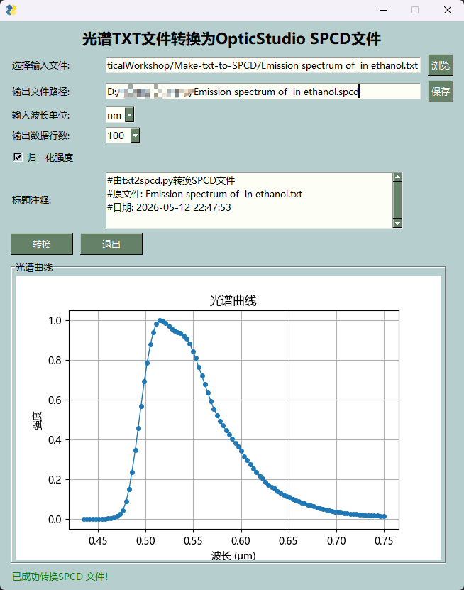

# Make-txt-to-SPCD

[中文](readme.md)|English

A tool for converting spectral data txt files to OpticStudio SPCD format. It provides an intuitive graphical user interface for easy conversion of spectral data into the format required by optical design software.



## Features
- Convert spectral data txt files to OpticStudio SPCD format
- Intuitive graphical user interface
- Support for multiple wavelength units (nanometer nm, micrometer μm)
- Optional intensity normalization
- Configurable data row limit (10, 20, 50, 100, 200 rows)
- Auto-includes original filename and conversion date in header comment
- Real-time spectral curve preview
- Customizable output file path

## Dependencies

Before using this tool, please install the following Python packages:

```bash
pip install FreeSimpleGUI
pip install matplotlib
```

## Usage

Run the script directly to launch the GUI:

```bash
python txt2spcd_GUI.py
```

In the graphical interface:
1. Click "Browse" to select the input txt file
2. Click "Save" to specify the output spcd file path
3. Select the number of data rows from the dropdown menu (10, 20, 50, 100, 200)
4. Select wavelength unit (nm or μm)
5. Choose whether to normalize intensity
6. Click "Convert" to start conversion

## Input File Format

The input txt file should contain two columns of data:
- First column: wavelength values (numeric)
- Second column: intensity values (numeric)
- Columns can be separated by spaces or tabs
- Comments lines starting with # are supported

Example:
```
400 0.1
450 0.3
500 0.7
550 0.9
600 0.6
650 0.2
700 0.05
```

## Output File Format

The output SPCD file follows the standard OpticStudio format:
- Wavelength in micrometers (μm)
- Up to 200 rows of data
- Two columns: wavelength (float), relative intensity (float)
- Supports intensity normalization in the 0–1 range

## Notes
- Input file must contain valid numeric data
- Wavelength values are automatically converted to micrometers (required by OpticStudio)
- For files with more than 200 rows, select an appropriate row count from the dropdown for evenly-spaced sampling
- Intensity normalization scales the maximum value to 1, with other values scaled proportionally

## Version History
- 2026.2.13 - Initial release
- 2026.3.24 - Added GUI and spectral curve preview

## License
MIT License
